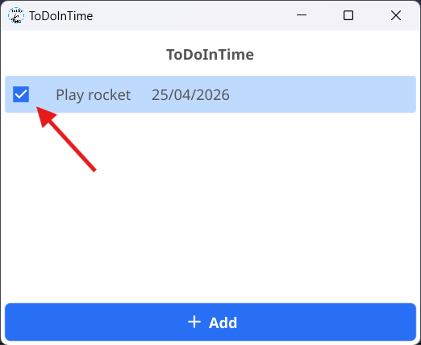

# Complete a Task

Nice! You’ve completed a task — time to mark it as done. Good boy

## Step 1: Find the Task

Open the app and look for the task you’ve completed in your task list.

## Step 2: Click the Checkbox

Once you’ve found the task, click the small checkbox on the left.

- If you see a ✔️ checkmark, the task is completed!
{width=400px}

## Done!

Your task is now marked as completed. Keep going and stay productive!