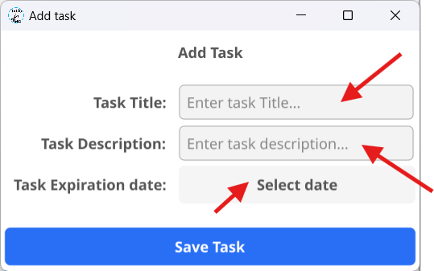

# Create a Task

Once you open **ToDoInTime**, you may notice that there aren’t many options available yet…  
That’s because you don’t have any tasks.

👉 So, let’s create your first one!

## Step 1: Click the Add Button

To create a new task, click the big blue button at the bottom of the screen labeled **"ADD"**.

{width=400px}

## Step 2: Fill in Task Details

After clicking the button, a window will appear.  
Here, you need to enter:

- **Task Title**
- **Task Description**
- **Task Expiration Date**

{width=400px}

## Step 3: Save the Task

Click **"Save Task"** to confirm.

🎉 Your task has now been successfully created!

{width=400px}

---

## Tip

Try creating multiple tasks to better organize your time and stay productive!