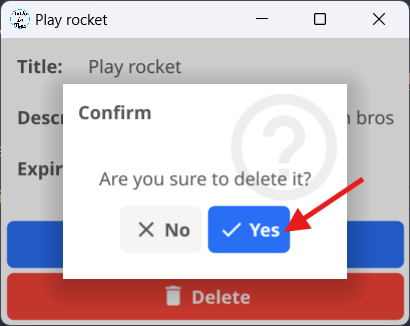

# Delete a Task

Did you create a task by mistake? No worries — you can delete it in seconds.

## Step 1: Open Task Details

Just like in the [edit guide](/Edit%20a%20Task), click on the task you want to delete.  
A details window will appear showing all the information about that task.

{width=400px align=center}

## Step 2: Click the Delete Button

In the details window, you’ll find two main options:

- ✏️ **Edit** the task (see the [edit guide](/Edit%20a%20Task))  
- 🗑️ **Delete** the task  

Click the **Delete** button to proceed.

## Step 3: Confirm Deletion

After clicking the delete button, a confirmation window will appear asking if you’re sure.

- Click **Yes** to permanently delete the task  
- Click **No** to cancel  

{width=400px}

## Tip

Deleted tasks cannot be recovered, so make sure you really want to remove them!