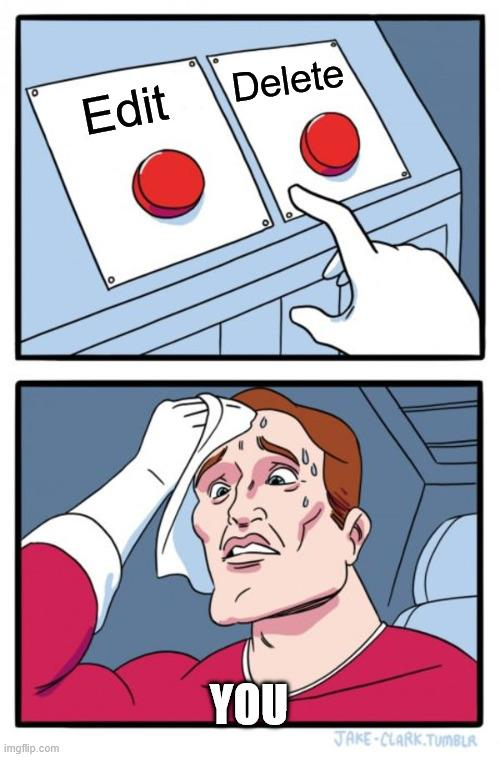
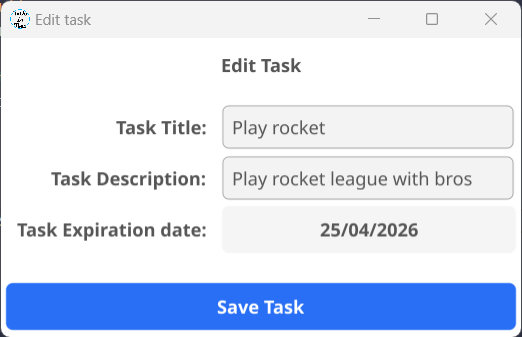

# Edit a Task

Need to update a task? No problem — editing is quick and easy.

## Step 1: Open Task Details

Click on the task you want to edit.  
A details window will appear showing all the information about that task.

{width=400px align=center}

## Step 2: Choose an Action

In the details window, you’ll find two main options:

- ✏️ **Edit** the task  
- 🗑️ **Delete** the task (see the [delete guide](/Delete%20a%20Task))

{width=300px text-align=center}

## Step 3: Click the Edit Button

Click the **Edit** button to modify the task.

## Step 4: Update Task Details

A new window will appear where you can edit:

- **Task Title**
- **Task Description**
- **Task Expiration Date**

{.center-img width=400px}

## Step 5: Save Changes

Once you're done editing, click **Save Task** to apply the changes.

🎉 Your task has been successfully updated!

## Tip

Keep your tasks updated to stay organized!