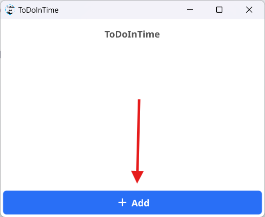
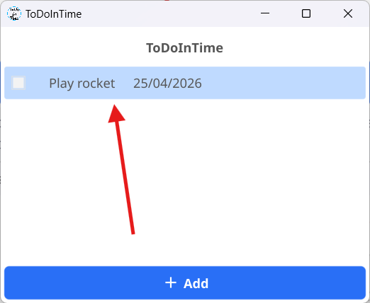

- Once Open **ToDoInTime** you can't se many options to do, you don't have any task, sooo **it's time to create a new one! 😝😝**
-
- To create a new task you have to click on the big blue button in the bottom of the screen called *"ADD"*
  
- When you click the button, a window appears and you have to insert a **Task title**, a **description** and an **expiration date** and you've done!
  
- Click **"Save Task"** and now you have create a task!
  