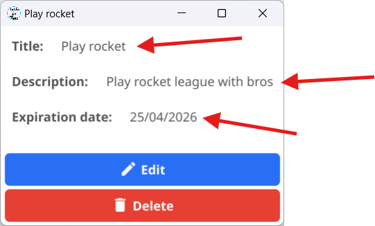

# Edit a Task
- First of all to **edit a task** you have to click that and a window appears
  
- In this window you can see the details of your task and you have to take a choice pressing one of the two buttons!
- In this page we're gonna see the **"Edit"** button, you can see the delete button here!